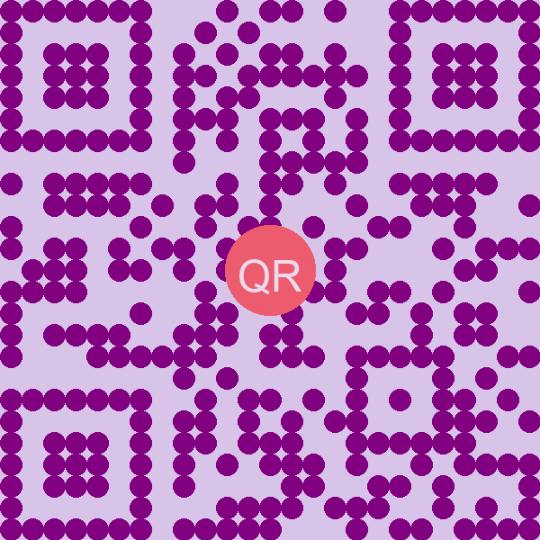
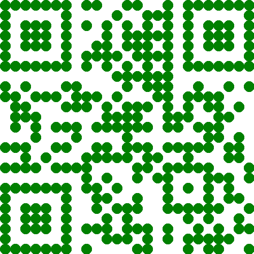

# Cool QRCode

一个用于生成个性化二维码的Python库，支持自定义颜色、形状、Logo和蒙板效果。



## 特性

- 🎨 **自定义颜色** - 支持命名颜色和十六进制颜色代码
- ⭐ **预设风格** - 内置8种精美配色方案
- 🔘 **自定义形状** - 支持方形和圆形码点
- 🖼️ **添加Logo** - 支持方形和圆形Logo
- 🎭 **蒙板效果** - 添加半透明色彩蒙板
- 💫 **万能API** - 通过单一函数支持所有效果组合
- 🚸 **学生友好** - 提供简单易用的中文API和教程

## 安装

```bash
pip install cool-qrcode
```

## 快速开始

### 基本使用

```python
from cool_qrcode import make_cool_qrcode

# 最简单的用法
make_cool_qrcode("Hello, World!", filename="basic.png")
```

### 使用预设风格

```python
# 使用海洋风格
make_cool_qrcode(
    "Hello, Ocean!",
    style="ocean",
    filename="ocean_style.png"
)
```


### 圆形码点

```python
# 使用圆形码点
make_cool_qrcode(
    "Hello, Circle!",
    dot_shape="circle",
    fill_color="green",
    back_color="white",
    filename="circle_dots.png"
)
```



### 添加Logo

```python
# 添加圆形Logo
make_cool_qrcode(
    "Hello, Logo!",
    logo_path="your_logo.png",
    logo_circular=True,
    filename="with_logo.png"
)
```


### 组合所有效果

```python
# 组合多种效果
make_cool_qrcode(
    "Hello, Cool QRCode!",
    style="berry",        # 使用预设风格
    dot_shape="circle",   # 圆形码点
    logo_path="logo.png", # 添加Logo
    logo_circular=True,   # 圆形Logo
    mask_color="purple",  # 紫色蒙板
    mask_opacity=0.15,    # 透明度
    size=600,             # 大尺寸
    filename="cool_qr.png"
)
```

## 文档

### make_cool_qrcode() 万能API

```python
make_cool_qrcode(
    data,                  # 二维码内容
    filename=None,         # 保存文件名
    size=500,              # 图片大小
    fill_color="black",    # 前景色
    back_color="white",    # 背景色
    style=None,            # 预设风格
    dot_shape="square",    # 码点形状
    logo_path=None,        # Logo路径
    logo_circular=True,    # Logo是否为圆形
    mask_color=None,       # 蒙板颜色
    mask_opacity=0.3       # 蒙板透明度
)
```

详细使用方法参见 [API文档](docs/API.md)。

## 支持的颜色

支持多种命名颜色和十六进制颜色代码，包括：

- 基础颜色：red, green, blue, yellow, purple, orange...
- 常用颜色：aqua, fuchsia, lime, maroon, navy, olive...
- 扩展颜色：lightblue, darkgreen, lavender...

详细颜色列表参见 [颜色参考](颜色参考.md)。

## 预设风格

内置8种精美配色方案：

- ocean - 海洋风格（蓝色系）
- forest - 森林风格（绿色系）
- sunset - 日落风格（橙色系）
- berry - 浆果风格（紫色系）
- fire - 火焰风格（红色系）
- mint - 薄荷风格（青色系）
- chocolate - 巧克力风格（棕色系）
- night - 夜空风格（深蓝系）

## 学生使用指南

专为学生设计的简体中文使用指南：[学生使用指南](学生使用指南.md)

## 示例

详细示例代码见 [examples](examples) 目录。

## 许可证

本项目采用 MIT 许可证 - 详见 [LICENSE](LICENSE) 文件 